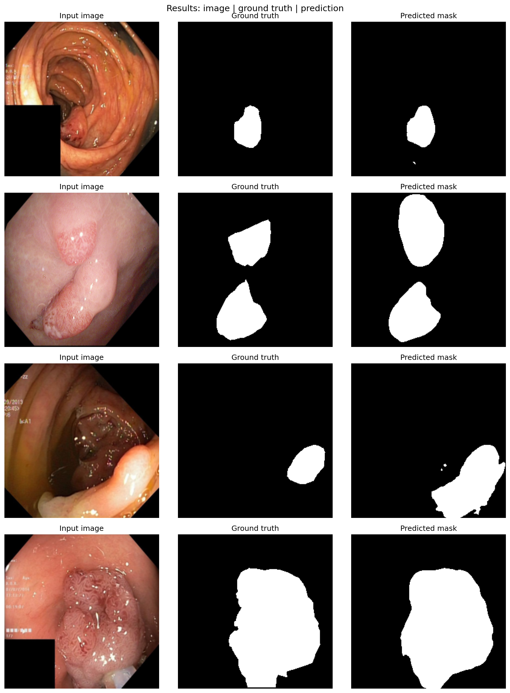

# Polyp Segmentation

A machine learning project for segmenting polyps from colonoscopy images using PyTorch and `segmentation-models-pytorch`. 

## 📌 Project Overview
This repository contains a Jupyter Notebook pipeline for training and evaluating a deep learning model on the [Kvasir-SEG dataset](https://datasets.simula.no/kvasir-seg/). The goal of the model is to accurately identify and segment polyps to assist in medical diagnostics.

## 📁 Repository Structure
```
├── data/                  # Directory for the Kvasir-SEG dataset (git-ignored)
├── models/                # Saved model weights (*.pth) (git-ignored)
├── notebooks/             # Jupyter notebooks for experimentation and training
│   └── polyp_segmentation.ipynb
├── results/               # Model output masks and performance visualizations
├── src/                   # Source code for data loaders, model definition, and utils
├── .gitignore             # Files and folders ignored by Git
├── LICENSE                # MIT License
├── README.md              # Project documentation
└── requirements.txt       # Python package dependencies
```

## 🚀 Installation & Setup

1. **Clone the repository:**
   ```bash
   git clone https://github.com/your-username/polyp-segmentation.git
   cd polyp-segmentation
   ```

2. **Create a virtual environment (optional but recommended):**
   ```bash
   python -m venv venv
   source venv/bin/activate  # On Windows: venv\Scripts\activate
   ```

3. **Install dependencies:**
   ```bash
   pip install -r requirements.txt
   ```

## 💾 Dataset
This project uses the **Kvasir-SEG** dataset. 
- Download the dataset and extract it into the `data/` directory.
- Ensure the folder is named `kvasir-seg/` so the notebook can find the images and masks.

## 🧠 Usage
The main workflow is currently contained in `notebooks/polyp_segmentation.ipynb`. 
- You can run the notebook locally using Jupyter or open it in Google Colab.
- **Note:** If running locally, you can safely ignore or remove any `google.colab` specific imports at the beginning of the notebook.

## 📊 Results
Below is an example of the model's segmentation output:



## 📄 License
This project is licensed under the MIT License - see the [LICENSE](LICENSE) file for details.
